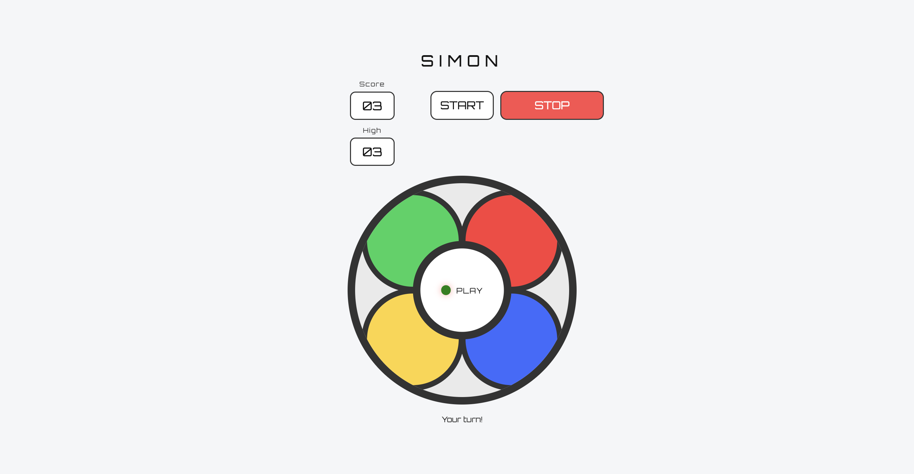

# 🎮 Simon Says Game (Web Version)

An interactive **Simon Says** game built using **HTML, CSS, and vanilla JavaScript**.  
The game challenges players to memorise and repeat an ever-growing sequence of colours, with increasing speed as the game progresses.

This project focuses on clean game logic, DOM manipulation, timing control, and user experience improvements.

---

## 🧠 How the Game Works

1. Click **START** to begin the game.
2. Simon plays a sequence of colours.
3. Repeat the sequence by clicking the coloured pads in the correct order.
4. Each round adds one new colour to the sequence.
5. The game speeds up as the sequence grows.
6. If you make a mistake, take too long, or press **STOP**, the game ends.

---

## ✨ Features

- Interactive Simon Says gameplay
- Four coloured pads with visual feedback
- Sound feedback for:
  - Each colour
  - Start button
- Increasing difficulty as levels progress
- Score and high-score tracking
- Timeout detection if the player does not respond
- **STOP button** to end the game at any time
- Clear on-screen text feedback (“Correct”, “Incorrect”, etc.)
- Responsive, centered layout suitable for different screen sizes


---

## 📸 Screenshot



---

## 🛠️ Technologies Used

- **HTML5** – Structure and semantic layout
- **CSS3** – Styling, positioning, responsiveness, animations
- **JavaScript (Vanilla)** – Game logic, sequences, timers, user input
- **Google Fonts (Orbitron)** – Retro digital-style font
- **HTML Audio API** – Sound effects

---

## 📂 Project Structure

```

├── index.html
├── styles.css
├── script.js
├── audio/
│   ├── green.mp3
│   ├── red.mp3
│   ├── yellow.mp3
│   ├── blue.mp3
│   └── start.mp3
├── screenshots/
│   └── game.png
├── README.md
└── LICENSE
```

---

## 🚀 How to Run the Project

1. Clone or download the repository
2. Open the project folder in **VS Code**
3. Right-click `index.html`
4. Select **“Open with Live Server”**
5. Click **START** and play

No build tools or dependencies required.

---

## 🎨 Design Notes

- The layout is inspired by the classic Simon game
- The interface is centered and responsive
- Visual, audio, and text feedback are all provided so the game is playable with or without sound
- The STOP button allows the player to exit long games instantly

---

## 🔮 Possible Future Improvements

- Difficulty selector (easy / normal / hard)
- Mobile-specific layout tweaks
- Optional voice prompts
- Animations for game start / reset
- Persistent high score using localStorage

---

## 📚 Learning & References

This project was developed using a combination of:
- W3Schools (HTML/CSS fundamentals)
- CSS-Tricks (layout and shapes)
- CodePen (visual inspiration)
- GitHub Simon game implementations (logic comparison)
- YouTube tutorials for JavaScript timing and sequence logic

All game logic was written and adapted manually to meet project requirements.

---

## 📄 License

This project is for educational purposes.